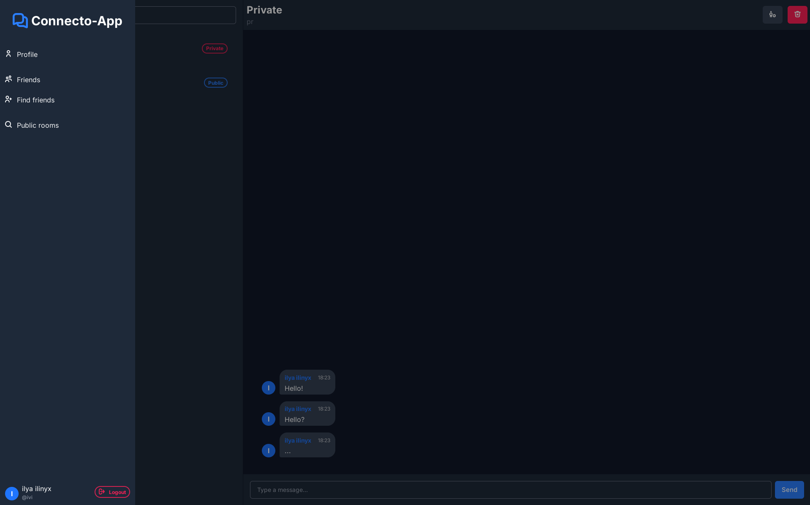
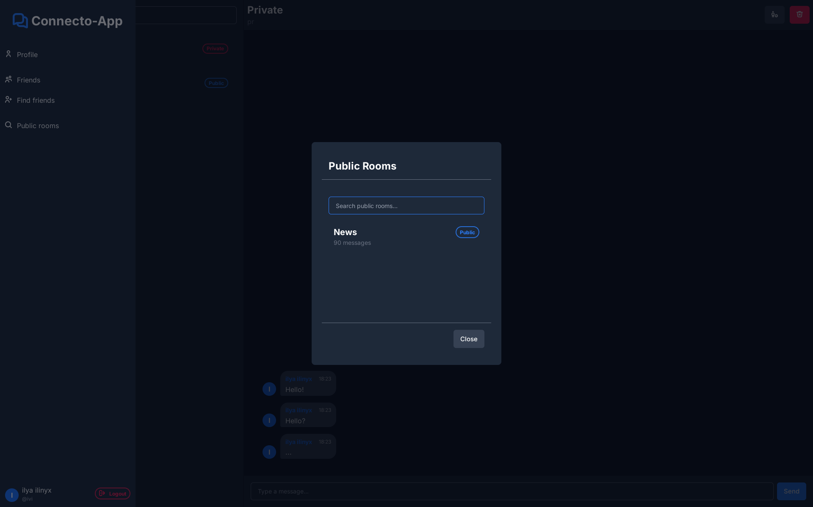

<p align="center"></p><a id='links'></a>

# <p align="center">Connecto-app</p>

### <p align="center">Минималистичный мессенджер</p>

##  Ссылки
### [Технологии](#technologies) | [Описание](#description) | [Маршруты](#routes) | [Инициализация](#init) | [Галерея](#galery)

##  Используемые технологии <a id='technologies'></a>[](#links)

[PHP 8.2](https://www.php.net/) - Язык программироваия.

[Laravel 12](https://laravel.com/docs) - Фреймворк.

[Laravel ReverB](https://laravel.com/docs/12.x/reverb) - Веб-сокеты.

[Mysql 8.0](https://www.mysql.com/) - База данных.

[Docker](https://www.docker.com/) - Контейнеризация.

[Laravel Sail](https://laravel.su/docs/12.x/sail) - Docker-интерфейс.

[Laravel Sanctum](https://laravel.su/docs/12.x/sanctum) - Cистема аутентификации.

##  Описание <a id='description'></a>[](#links)

Проект представляет собой RESTful API мессенджер c Веб-версий и веб-сокетами.

### Основные сущности

- **Пользователи** (2 типа: `обычный (user)`, `админ (admin)`)
- **Комнаты** (3 типа: `публичный(public)`, `приватный(private)`, `личный(personal)`)
- **Сообщения**

### Связи между сущностями

- Пользователь → много друзей
- Пользователь → много комнат
- Одна комната → много пользователей
- Одна комната → много сообщений
- Одно сообщение → много реакций
- Одна реакция → много сообщений

### Технические особенности
- **Пагинация** для всех списков

##  Маршруты <a id='routes'></a>[](#links)

### Публичные маршруты (без аутентификации)

| Метод | Эндпоинт | Описание |
|-------|----------|----------|
| POST | `/register` | Регистрация пользователя |
| POST | `/login` | Авторизация пользователя |
| GET | `/login` | Проверка аутентификации (возвращает 403) |
| GET | `/rooms` | Получение списка комнат |
| GET | `/rooms/search` | Поиск комнат |
| GET | `/users/search` | Поиск пользователей |

### Защищенные маршруты (требуют аутентификации)

| Метод | Эндпоинт | Описание |
|-------|----------|----------|
| POST | `/logout` | Выход из системы |

#### Маршруты друзей

| Метод | Эндпоинт | Описание |
|-------|----------|----------|
| GET | `/friends` | Получение списка друзей |
| GET | `/friends/pending` | Получение ожидающих запросов дружбы |
| POST | `/friends/{user}` | Отправка запроса дружбы |
| PUT | `/friends/{user}/{command}` | Обновление статуса дружбы |
| DELETE | `/friends/{user}` | Удаление из друзей |

#### Персональные чаты

| Метод | Эндпоинт | Описание |
|-------|----------|----------|
| POST | `/rooms/friend/{user}` | Создание персонального чата |

#### Маршруты чат-комнат

| Метод | Эндпоинт | Описание |
|-------|----------|----------|
| GET | `/rooms/joined` | Получение присоединенных комнат |
| GET | `/rooms/{room}` | Получение информации о комнате |
| POST | `/rooms/{room}/join` | Присоединение к комнате |
| POST | `/rooms/{room}/logout` | Выход из комнаты |
| POST | `/rooms` | Создание новой комнаты |
| PUT | `/rooms/{room}` | Обновление информации о комнате |
| DELETE | `/rooms/{room}` | Удаление комнаты |
| POST | `/rooms/join` | Приглашение в комнату |

#### Маршруты сообщений

| Метод | Эндпоинт | Описание |
|-------|----------|----------|
| GET | `/rooms/{room}/messages` | Получение сообщений комнаты |
| POST | `/messages` | Отправка сообщения |
| DELETE | `/messages/{message}` | Удаление сообщения |
| POST | `/messages/{message}/react/{reaction}` | Добавление реакции к сообщению |
| DELETE | `/messages/{message}/react/{reaction}` | Удаление реакции с сообщения |

#### Маршруты пользователей

| Метод | Эндпоинт | Описание |
|-------|----------|----------|
| GET | `/profile` | Получение профиля текущего пользователя |
| GET | `/users` | Получение списка пользователей |
| GET | `/users/{user}` | Получение информации о пользователе |
| PUT | `/users/{user}` | Обновление информации о пользователе |

#### Административные маршруты

| Метод | Эндпоинт | Описание |
|-------|----------|----------|
| POST | `/users/{user}/block` | Блокировка пользователя (только админ) |
| POST | `/users/{user}/unblock` | Разблокировка пользователя (только админ) |

##  Инициализация <a id='init'></a>[](#links)
> [!NOTE]
> Рекомендуется использовать DNS 8.8.8.8 для избежания проблем с контейнерами.
### Предварительные требования

```bash
sudo apt update && sudo apt upgrade -y
```
### Установка зависимостей:
```bash
composer install
```
### Настройка окружения
```bash
cp .env.example .env
```
### Запуск Docker
> [!NOTE]
> По умолчанию в docker-compose.yml находится development версия.
```bash
cp docker/production/docker-compose.prod.yml docker-compose.yml
docker compose up -d --build
```
### Генерация ключа
```bash
docker compose exec app php artisan key:generate
```
### Инициализация БД
```bash
docker compose exec app php artisan migrate --seed
```
### Все команды
```bash
sudo apt update && sudo apt upgrade -y
```
```bash
composer install
cp .env.example .env
cp docker/production/docker-compose.prod.yml docker-compose.yml
docker compose up -d --build
docker compose exec app php artisan key:generate
sleep 5
docker compose exec app php artisan migrate
```
### После успешного запуска система будет доступна по адресу:
### `http://localhost`

##  Галерея <a id='galery'></a>[](#links)
### Авторизация:


### Чат:






